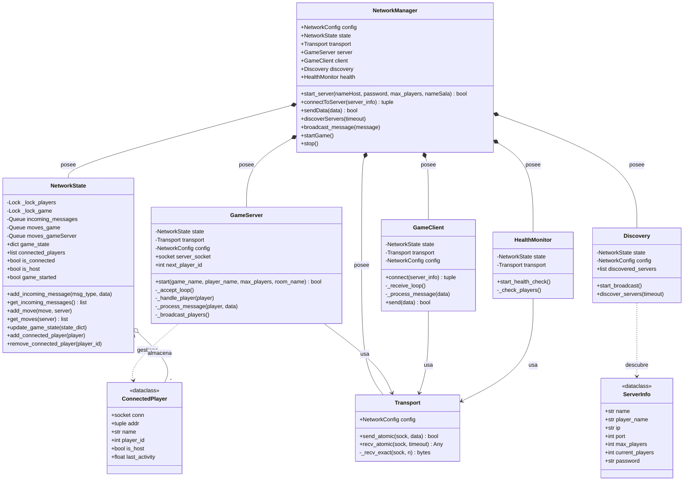

# Diagrama UML del Módulo de Redes (Rummy 500)

Este diagrama representa la arquitectura refactorizada del sistema de redes, siguiendo el patrón **Facade** y asegurando la seguridad entre hilos (**Thread-Safety**).

# si no logras visualizar el siguiente diagrama, ver UML_redes_refactor.png adjunto

## Descripción de Componentes Clave

### 1. NetworkManager (Fachada)
Es el punto de entrada único para la interfaz de usuario (`ui.py`). Orquesta todos los sub-servicios y oculta la complejidad interna de sockets e hilos.

### 2. NetworkState (Estado Compartido)
Actúa como la "Fuente de la Verdad" del módulo. Utiliza **Locks** y **Queues** de Python para garantizar que múltiples hilos (recepción, envío, broadcast) no corrompan los datos.

### 3. Transport (Capa de Comunicación)
Encargada de la serialización con `pickle` y de asegurar que los mensajes lleguen completos mediante un encabezado de longitud (4 bytes). Previene el problema de "mensajes cortados" en TCP.

### 4. GameServer & GameClient
Contienen la lógica específica de cada rol. El servidor gestiona múltiples clientes en hilos separados, mientras que el cliente mantiene un único hilo de escucha constante.

### 5. Discovery & HealthMonitor
- **Discovery**: Usa UDP Broadcast para que los jugadores encuentren partidas en la misma red local sin saber la IP.
- **HealthMonitor**: Implementa un sistema de *Heartbeat* (Latido) para detectar y desconectar jugadores que pierden la conexión de forma abrupta.